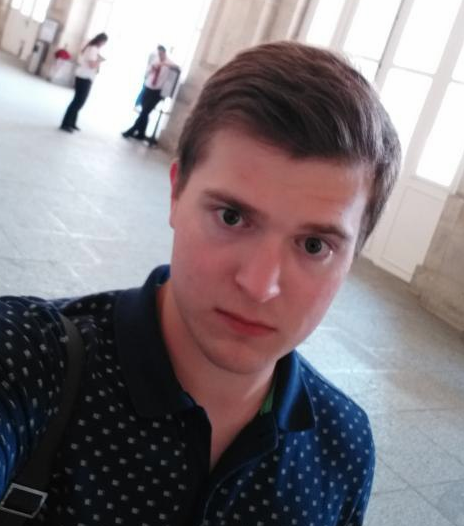

Студент программы "Экономика IT и управление данными" факультета финансовой экономики МГИМО Максим Рыжиков поделился своими впечатлениями от программы и рассказал о том, как проходит обучение в ЦМФ.

**— Кто такие "кванты" и как ими стать?**

— Кванты – это специалисты, работающие в сфере экономики и финансов, владеющие и применяющие современные технологические инструменты. Такие специалисты с каждым годом становятся все более востребованными на рынке и работают в наиболее сложных направлениях деятельности компании: построение прогнозов, оптимизация портфелей, управление рисками, разработка торговых алгоритмов, подготовка аналитики для принятия решений. Условия труда, конечно же, пропорциональны сложности выполняемых задач, что и привлекает молодых специалистов развивать карьеру в данном направлении. Но как понять, какой объем знаний и какой глубины будет достаточен для успешной конкуренции в данной области?

**— Как вы узнали о программах ЦМФ и какой фактор стал для вас решающим при поступлении?**

— Полгода назад я практически случайно наткнулся на образовательную организацию ЦМФ - Центр математических финансов, который готовит специалистов в части количественных финансов, они же "кванты". Преподавательский состав состоит из реальных практиков ведущих финансовых организаций, которые дают актуальные знания, которые пригодятся в работе, и могут рассказать не только "как должно быть", но и "как бывает на самом деле".

На выбор были представлены несколько направлений: количественная аналитика, риск менеджмент и анализ данных. Сам же я пошел на риск менеджмент, потому что это направление было наименее знакомым для меня, с анализом данных и количественной аналитикой я так или иначе сталкивался ранее. Желание развиваться в риск менеджменте было также навеяно стажировкой, которую я проходил в блоке финансовых рисков.

**— Какие дисциплины и как будут преподавать?**

— Несмотря на различные направления, у программ пересекается часть блоков и каждая заточена на выпуск "квантов". То есть в программе каждого направления будут как математические блоки, так и финансовые. Различия же будут в наличии или отсутствии дополнительных профильных дисциплин.
Также программа предусматривает выполнение проектных работ, которые могут пересекаться между специализациями, и дополнительные семинары с экспертами. Перечень проектов весьма разнообразен и выбирается студентами. От себя отмечу, что некоторые проекты очень специфичны для отрасли, то есть знания, полученные на них трудно найти в открытом доступе, но при этом они крайне полезны для конкретной отрасли.

**— Какой проект запомнился вам больше всего?**

— Лично мне запомнился проект по калибровке экспертных оценок на макроэкономические данные. Проект предполагал моделирование экспертных оценок вероятностей дефолта (PD) компаний на основе макроэкономических и отраслевых данных, а затем осуществление базельской калибровки (through-the-cycle) модельных значений на данные рейтинговых агентств. Как оказалось впоследствии, подобная процедура активно применяется при построении моделей кредитного риска. В результате я устроился работать в риск-менеджмент. На работе несколько раз обращался к коду, который написал во время проекта в ЦМФ. Менторы по проекту также были очень отзывчивыми и часто организовывали дополнительные семинары для объяснения непонятностей.

**— На студентов какого уровня подготовки рассчитана программа ЦМФ?**

— Программа рассчитана как на новичков (то есть в первой половине обучения преподается математическая статистика с самых азов, также с нуля дается отчетность компании), так и будет интересна ребятам, уже имеющим знания в экономике: проходятся продвинутые производные финансовые инструменты (что из себя представляют, где и зачем применяются) и методы их оценки, клиринговые расчеты, страхование, управление портфелем, виды рисков и их оценка. В целом программа довольно близко совпадает с международным экзаменом FRM. По итогам программы, несмотря на уже имеющееся образование в экономике, могу уверенно сказать, что вынес для себя много нового.

**— Расскажите о форме обучения, это дистант?**

— Обучение полностью дистанционное: предоставляется доступ к большой библиотеке видеоматериалов и приложений к ним, обучаться можно в своем темпе, единственным дедлайном выступают - промежуточные экзамены. По субботам также проводятся дополнительные онлайн семинары и тематические выступления экспертов.

**— Что ждет выпускников программы?**

— Отдельно хочу отметить поддержку студентов на после-выпускных этапах и сильное комьюнити. Честно говоря, не считал никогда себя общительным человеком и очень скептически относился к подобным вещам, но в данном случае организаторы очень приятно удивили. Выпускникам не только оказывают содействие в поиске работы, но и организуют тематические выступления экспертов, которые лично мне также многое дали.

И самое интересное, что все это бесплатно. Цена – только твое время и усидчивость, которые по итогам окупаются сполна. Хочу еще раз выразить свою большую благодарность организаторам! Специалисты в ЦМФ действительно крутые эксперты и приятные в общении люди!

---

Факультет финансовой экономики МГИМО поддерживает развитие программ Центра математических финансов, где наши студенты могут реализовать практические проекты в составе межвузовских команд и найти новые возможности профессионального роста. Подробнее о наборе на программы ЦМФ осеннего семестра 2022 года читайте [здесь](https://finec.mgimo.ru/blog/cmf-for-quantative-finance-fall-2022/).
